layout: true

background-image: url(images/MDCRC6430SlideBackground16-9.jpg)
background-size: cover

---

```{r setup, include = FALSE}
options(htmltools.dir.version = FALSE)
library(knitr)
library(xaringanExtra)
library(showtext)
library(kableExtra)
opts_chunk$set(echo=FALSE)

# set engines
knitr::knit_engines$set("markdown")


```

class: top, middle

.bigger[.blue[Session Objectives]

* To understand what motivates investigators to consider codes of conduct when contemplating human
subjects research

* To survey the evolution and architecture of regulatory schemes that are applicable to human research

* To review universal requirements for the ethical conduct of clinical research]

---

class: center, middle

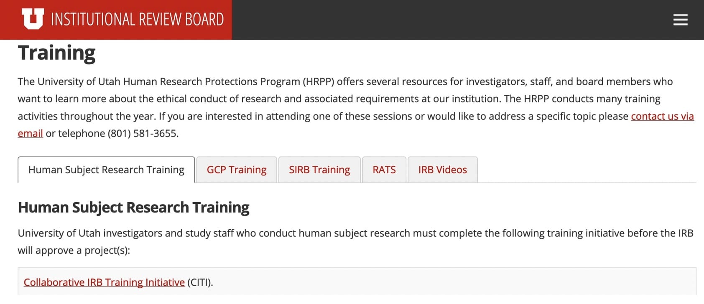
---

class: center, middle

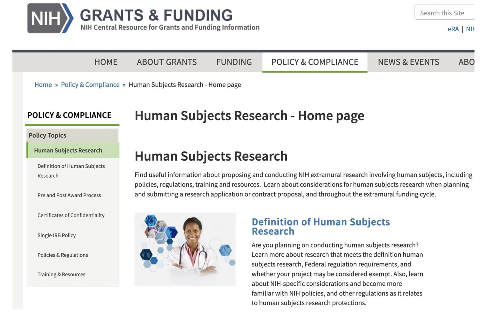

---

class: center, middle

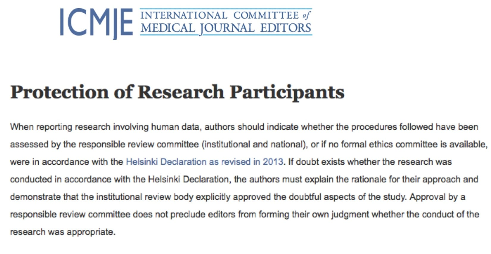
---

class: center, middle

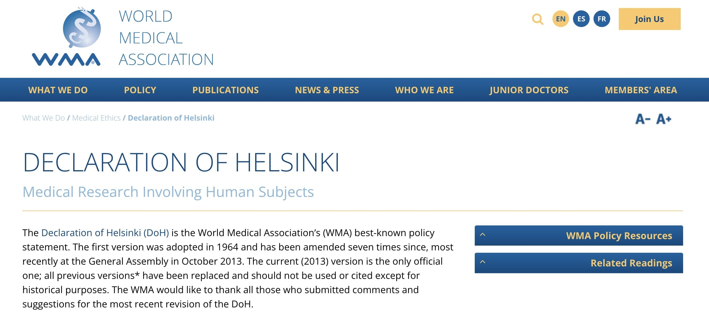


---

class: center, middle

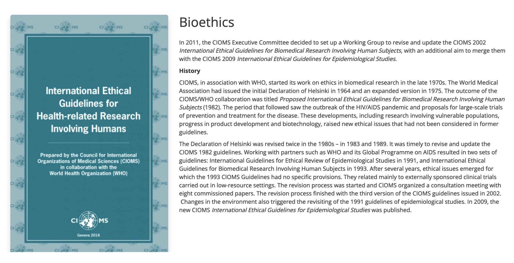

---

class: center, middle

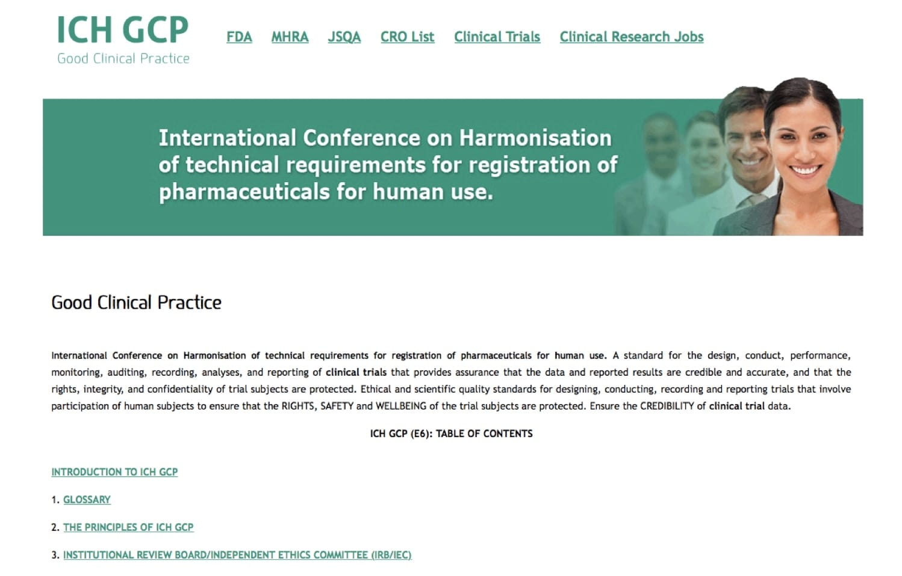

---

class: top, middle

.bigger[.blue[The evolution and architecture of regulatory schemes that are applicable to human research]

]

.big[.grey[Awareness of ethical transgressions in human research]

]

Well known examples:

* Human experimentation in Germany in WW II

* Tuskegee syphilis study

1932 – 1972. Conducted by the U.S. Public Health Service

Enrolled 600 impoverished, African-American sharecroppers from Macon County, Alabama; 399 who had previously contracted syphilis before the study began, and 201 without the disease. Participants were not offered penicillin after its efficacy became known.


---

class: center, middle

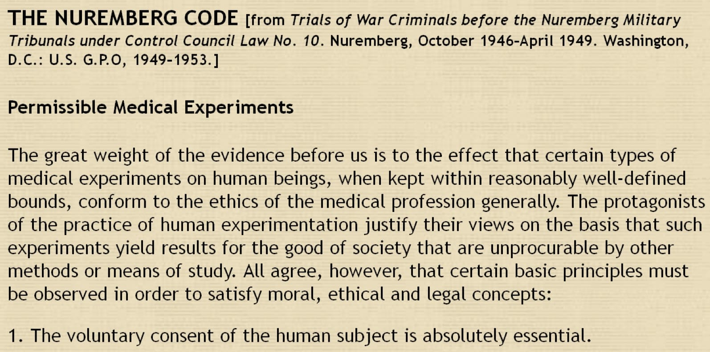

---

class: center, middle

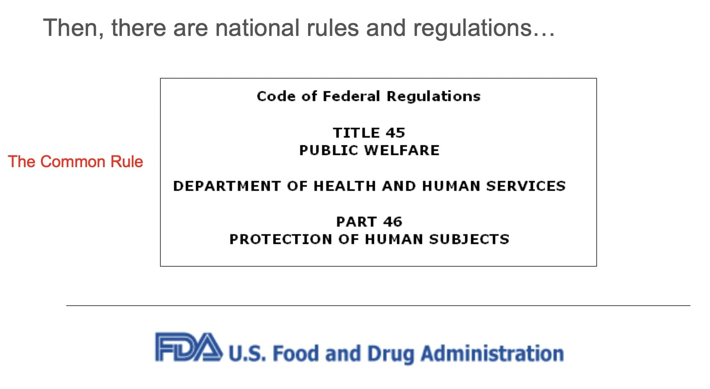

---

class: center, middle

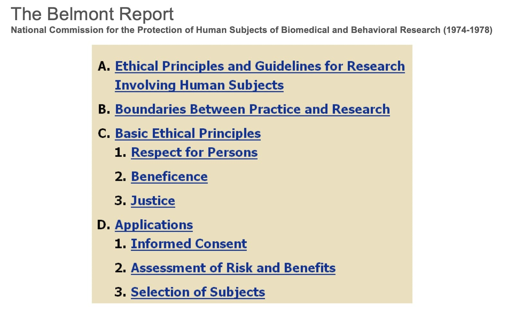

---

class: left, middle


.big[.blue[What makes clinical research ethical ?]]

--

* social and scientific value

--

* scientific validity

--

* fair subject selection

--

* a favorable harm-benefit balance

--

* independent review

--

* informed consent

--

* respect for potential and enrolled subjects

.small[Source: Emanuel, EJ, et al. JAMA 2000; 283]

These may be considered seven *universal* requirements for ethical research. 

---

class: left, middle

.big[.blue[Social and scientific value]]

 * the research should address the needs and priorities of the host community
 
 * the proposed research should address a question answerable by the scientific method

 * the research should address important knowledge gaps: what is the current state of knowledge about this topic, and how will the research meaningfully add to it ?

 .grey[This question commonly necessitates a Systematic Review of the relevant literature]

 * the research should address credible scientific, not (solely) commercial, objectives

 * all research results (positive and negative) should be made publicly accessible

 * a plan for data sharing should be devised
 
 
---

class: left, middle

.blue[Is the research questionable addressable by the scientific method ?]

Examples of controverted proposals for clinical research:

* homeopathy (and other interventions in Complementary & Alternative Medicine)

* intercessory prayer

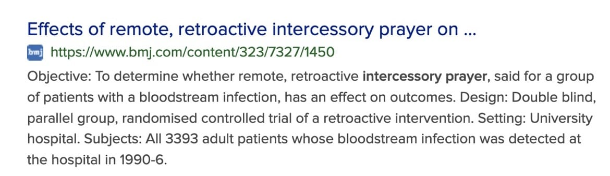
---

class: center, middle

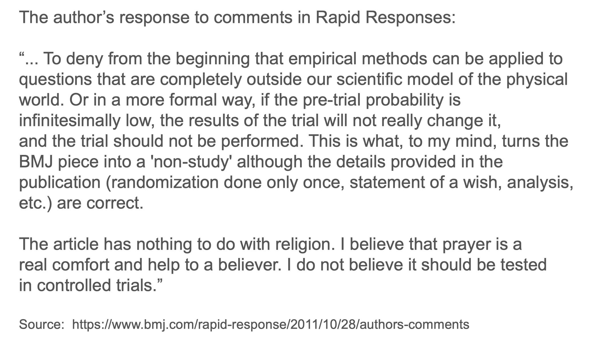
---

class: left, middle

.pull-left[.blue[The research should address important knowledge gaps: what is the current state of knowledge about this topic, and how will the research meaningfully add to it ?]

An example: the question about the value of Erythropoietin in chronic anemia

]

.pull-right[

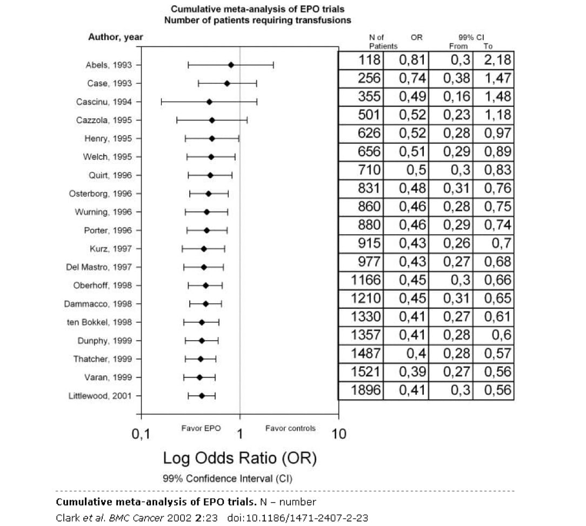

]
---

class: left, middle

.big[.blue[The research should address credible scientific, not (solely) commercial, objectives]]
 
 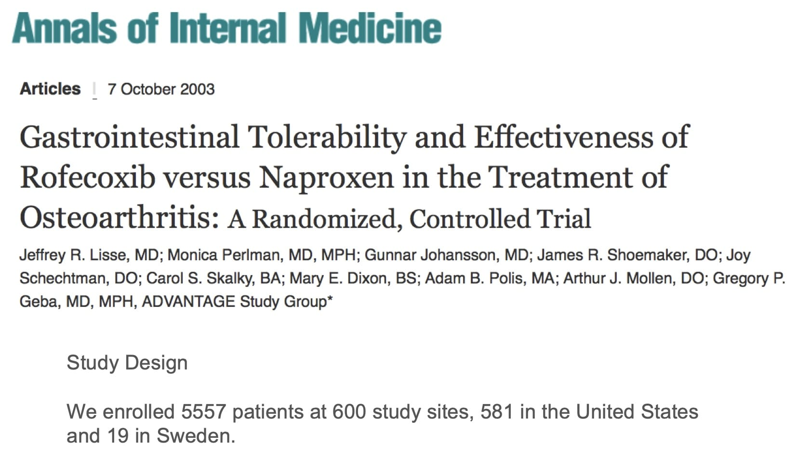
---

class: center, middle
 
 

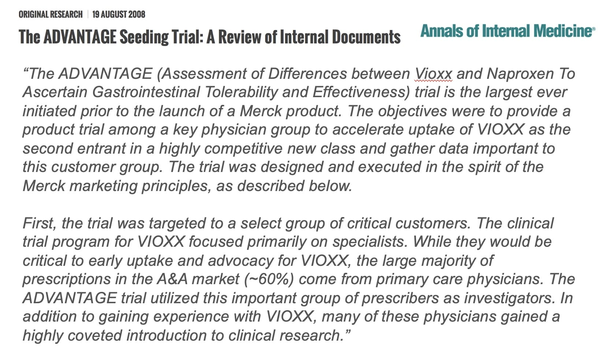
 
---
class: left, middle 


.blue[All research results (positive and negative) should be made publicly accessible

]

* the practice of *evidence-based medicine* should be based on the totality of information

* _publication bias_ adversely affects the credibility and utility of narrative Systematic Reviews and meta-analyses

* this bias is often a consequence of failure to report disappointing (negative) results

* publication bias may result in the repetitive performance of futile research, particularly early-phase research


---

class: left, middle


.pull-left.w40[


.blue[A data-sharing plan should be devised]

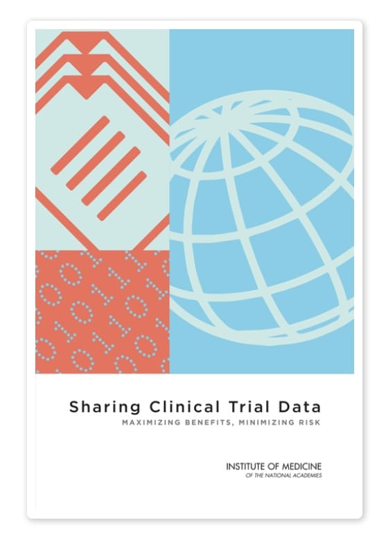

Source:  https://www.nap.edu/read/18998

Excerpts alongside:

]

.pull-right.w60[

* From the perspective of clinical trial participants, data sharing increases their contributions to generalizable knowledge about human health by potentially facilitating additional findings beyond the original, prespecified clinical trial outcomes.

* From the perspective of society as a whole, sharing of data from clinical trials could provide a more comprehensive picture of the benefits and risks of an intervention and allow health care professionals and patients to make more informed decisions about clinical care. 

* Sharing clinical trial data could potentially lead to enhanced efficiency and safety of the clinical research process by, for example, reducing unnecessary duplication of effort and the costs of future studies, reducing exposure of participants in future trials to avoidable harms identified through the data sharing, and providing a deeper knowledge base for regulatory decisions


]

---

class: center, middle

.blue[Resources for data storage and sharing -- an example:]

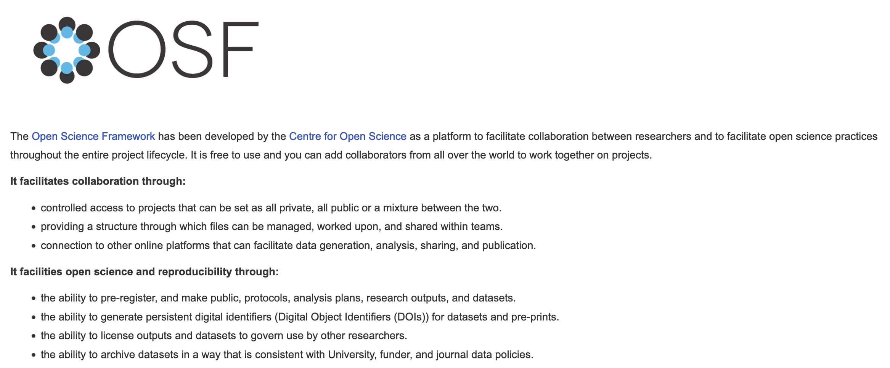
---


class: center, middle

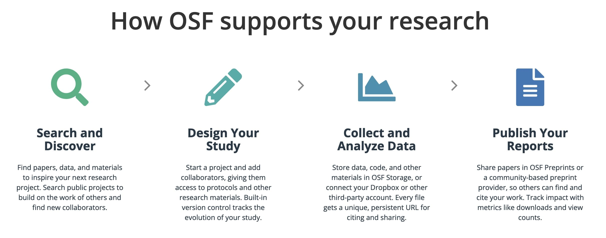

---

class: left, middle

</br>

.pull-left[

.big[.blue[Scientific validity]]

.big[

* Choose the research design that is pertinent to the scientific question. This necessitates a thorough knowledge of the architecture of clinical research.

* Conduct the research to minimize Systematic Error.

]]

.pull-right[

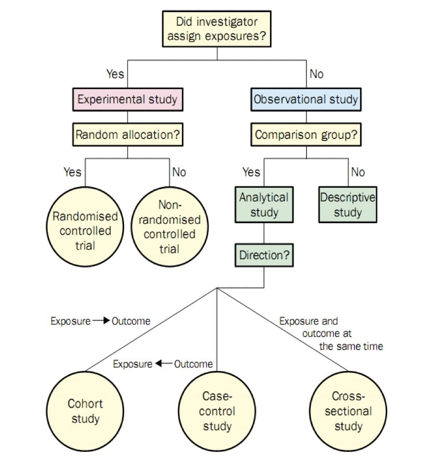

]

---


class: center, middle

These are reorting guidelines, but are very useful in creating a proper *research protocol*.

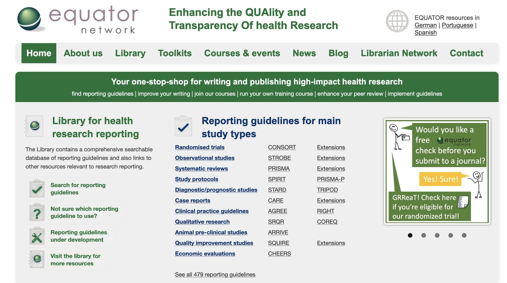
 
---

class: center, middle

.pull-left.w60[

</br>

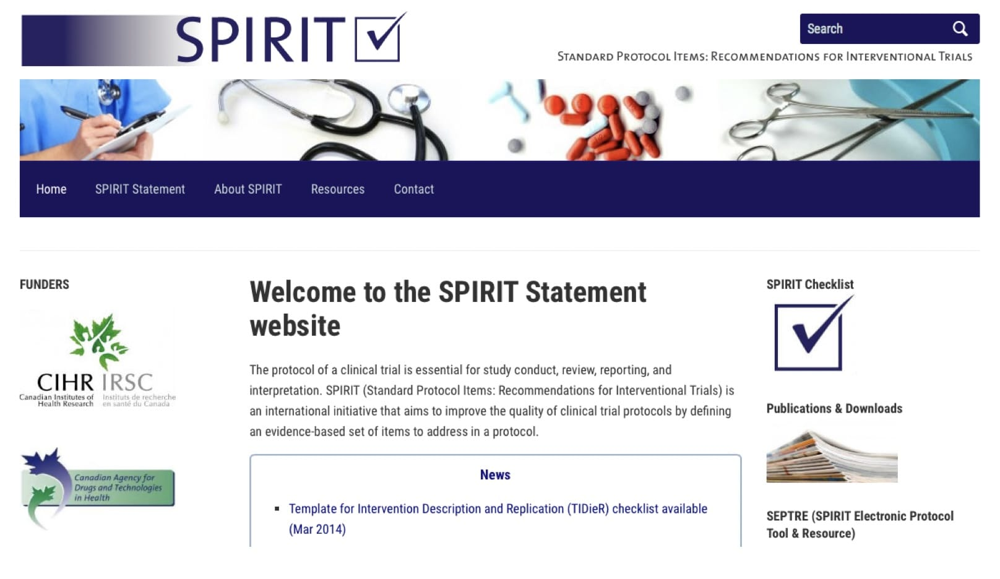

]
 
.pull-right.w40[

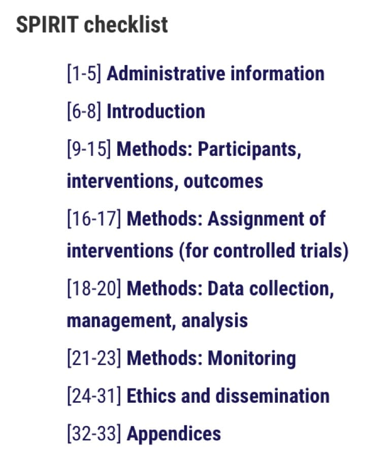

] 

---

class: left, middle

.big[.blue[Fair subject selection]
 
* inclusion criteria should serve proper social and scientific imperatives

* recruitment should not be exploitative or target those situationally vulnerable – e.g., institutional or deferential vulnerability

* recruitment in international research should reflect considerations of social and cultural exigencies — and distributional justice.  

]

---

class: left, middle

.big[.blue[A favorable balance of benefits and harms]

* Clinical research (clinical trials) typically involves therapeutic and non-therapeutic components.

* Assessment should be logical and systematic:

  - Harms associated with .purple[therapeutic] components are justified by the prospect of direct health-related benefits

  - Harms associated with the .purple[non-therapeutic] components have to be justified in relation to the knowledge anticipated
  
]
  
---

class: left, middle

.big[.blue[Informed Consent]

The core elements are:

* A process by which .purple[relevant] and .purple[comprehensible] information is provided.

* A process whereby comprehension is confirmed

* A process whereby an autonomous choice (informed, intentional, and free from undue influence or coercion) is facilitated

NB: An appreciation of the notion of decisional capacity and “proxy” consent for research


]

---

class: left, middle

.big[.blue[Respect for potential and enrolled subjects]

* Maintain the privacy and confidentiality interests of potential and enrolled participants

* Keep enrolled participants informed of developments that may affect their willingness to continue participation

* A process of “re-consent” may be relevant in certain research

* Ensure that you have a plan to deal with unanticipated and incidental discoveries about participants

* Inform participants about the results of the research


]

---

class: left, middle

.bigger[.blue[Privacy and confidentiality]]

.big[.grey[Privacy]]

Having control over the extent, timing, and circumstances of sharing aspects and attributes of oneself (e.g., physical, behavioral, intellectual) with others

.big[.grey[Confidentiality]]

The treatment of information that an individual has disclosed in a relationship of trust , with the expectation that it will not be divulged to others in ways that are inconsistent with the understanding of the original disclosure, without the individual’s permission


---

class: left, middle

.big[.blue[Keep enrolled participants informed of developments that may affect their willingness to continue participation]

* Inform participants about unanticipated or newly- identified harms

* Inform participants about new alternative interventions

* Informing participants about overall trial progress may promote retention

]

---

class: left, middle

.big[.blue[A plan to deal with incidental findings]]

* This is particularly important in genetic research and research that involves medical imaging

* This possibility should be disclosed during the consent process

* One should distinguish between certain and ambiguous findings, and consider their potential relevance for a participant’s present and future health.

* Inform the participant -- not “just” the participant’s physician -- about incidental findings

---

class: left, middle

.big[.blue[Informing participants about the research results]]

.grey[Potential benefits of offering to share research results]

* Acknowledging the participant’s contribution to the acquisition of knowledge

* Providing information that may enhance the participant’s future health

* Raising public awareness of the impact of research on the practice of (evidence-based) medicine

* Enhancing trust in researchers and the research regime

</br>

.small[Source: Fernandez, et al. *IRB* May-June 2005]

---

class: left, middle

.pull-left.w40[.blue[Case discussion for session 2]]   

.pull-right.w40[.blue[Questions]]

.pull-left.w50[.small[Dr. Jones, a university faculty member in the department of neurology, has been invited to participate in an industry-sponsored, multicenter clinical trial involving patients with relapsing multiple sclerosis. It is designed as a twelve-month, double-blind, randomized controlled trial comparing an oral investigational drug to placebo. Dr. Jones has a multiple sclerosis clinic and has been asked to try enroll about ten patients during the course of the trial. He will be paid a capitation fee (the amount subject to negotiation) for each patient he enrolls. 

He will not be a member of the trial's Steering Committee. He doesn't anticipate being invited to be a co-author on any trial-related publications.

He is also informed that patient-participants completing the trial will be offered participation in a follow-on, open-label extension trial of the investigational agent for an additional year, unless the drug is determined to be efficacious and approved by the FDA in the interim, or the drug development process is terminated by the Sponsor.
]]

.pull-right.w40[.small[

* What factors bear on the determination that a placebo-only control group will satify the criterion of a balance between potential benefits and harms ? 

* Do any ethical concerns arise from the payment of negotiated _capitation_ fees ? Should this be disclosed in the Consent Document ? If yes, how should it be described ?

* When a particular patient is invited to participate in the open-label extension study, what additional information should be given to the potential participant that is relevant to their decision concerning the offer ?

* The faculty member and Office of Sponsored Projects have to sign-off on contracts with the Sponsor before the trial is initiated. In this instance, the contract doesn't have a section on the reporting of the trial's results.  What should the faculty member do about this ?


]
]


```{css echo=FALSE}
.highlight-last-item > ul > li, 
.highlight-last-item > ol > li {
  opacity: 0.2;
}
.highlight-last-item > ul > li:last-of-type,
.highlight-last-item > ol > li:last-of-type {
  opacity: 1;
}
```


